# Termany

**A terminal for running many coding agents at once.**

Termany keeps a large number of agent sessions in one window, tells you which session needs
you, and puts the work around those sessions in the same place: diffs, worktrees, ports,
remote hosts, and token cost.

Website: **[termany.sh](https://termany.sh)** — downloads, docs, and release notes.

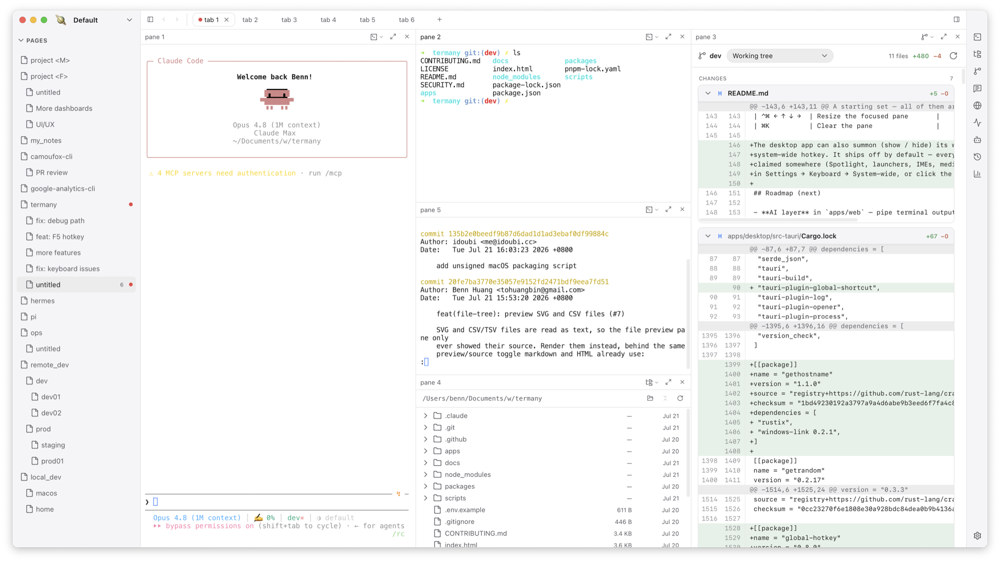

## Is this for you

Termany helps most if you:

- run five or more agent sessions at the same time
- use Claude, Codex, and other agents on the same repository
- keep several worktrees of one project open, and hit port conflicts between them
- move long tasks to a dev box so they survive a sleeping laptop

If you don't work this way, Termany still works as a plain terminal with splits, themes,
and an inline file viewer.

## Many sessions in one window

Panes nest three levels: **workspace** (far-left rail, one context such as a client or a
product), **page** (left sidebar, one project or area), and **tab** (top strip, one shell
each). Every pane splits again with ⌘D and ⇧⌘D. Every tab is a persistent session: it keeps
running, and keeps its scrollback, while backgrounded.

Termany tags each pane *working*, *done*, or *needs attention*. It reads the pane's
foreground job and the changes on screen, not the shell prompt, so the tag also works for
agents that draw their own interface. Tagged panes appear in an **ACTIVE** section above the
page tree, so you do not open twenty tabs to find the one that stopped.

⌘P searches commands, pages, tabs, and panes by name. ⌘M maximizes one pane over a dimmed
background. On desktop, ⌥⌘N opens a second window on the same workspaces.

Launch an agent into any pane from the right-hand rail. **Claude, Codex, Gemini, OpenClaw,
FastClaw, Hermes, OpenCode, Kilocode, Cursor, Kimi, Droid, and OMP** ship built in. Claude,
Codex, and OpenClaw are enabled by default; enable the rest with one toggle. Point an agent
at a different binary, or add your own agent, in Settings → Agents. **Detect** probes your
machine and lists what it finds.

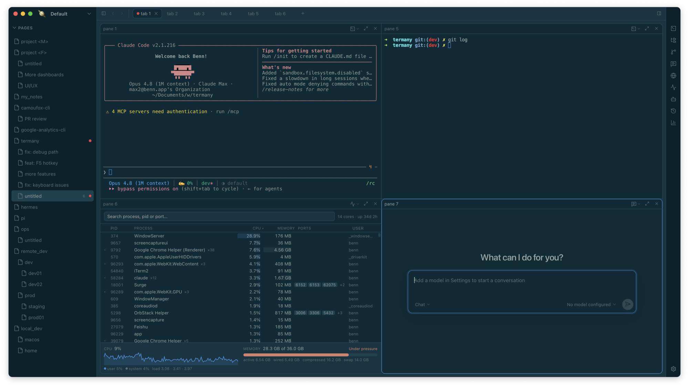

## Review in the same window

Any pane can switch from a shell to another view. ⌘E cycles the views:

- **Files** — a file tree. Click a file to edit it in place (CodeMirror, language detection,
  ⌘S to save), or to read it. Markdown, HTML, images, video, audio, PDF, DOCX, XLSX, and
  PPTX preview inline.
- **Git diff** — staged, unstaged, and untracked changes. Compare the working tree against
  another base. Switch to another worktree of the same repository from the same panel.
- **Conversation** — a chat pane over ACP, with its own model picker.
- **Browser** — a webview. When a pane starts to serve a port, Termany offers to open it.

An agent runs in one pane, and its diff opens in the pane next to it.

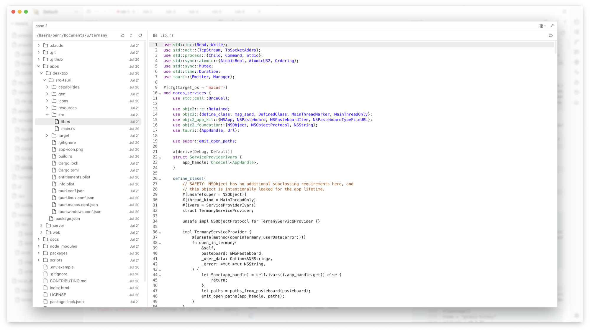

## Worktrees and remote hosts

- **Per-pane SSH.** Each pane picks its own connection, so a local shell and two remote hosts
  can sit in one tab. Add a connection with a display name, an optional port, and automatic,
  password, or identity-file authentication. **Test connection** checks it before you need
  it. A dropped session reconnects when you press Enter. When a remote pane starts serving a
  port, one click opens an SSH forward on loopback, so the remote URL opens locally.
- **Session history across worktrees.** ⇧⌘H lists past agent conversations for the repository
  that holds the focused pane. Sessions group by branch, and cover every worktree of that
  repository. Sessions whose directory no longer exists appear under **Deleted worktrees**,
  and resume from the main checkout. Any session resumes in a new pane, already `cd`'d to
  its project.
- **Activity monitor.** ⇧⌘M shows CPU, memory, swap, and memory pressure, plus the process
  list grouped by program. Type a port number in the search box to find the process that
  holds it, then terminate it from the same row.

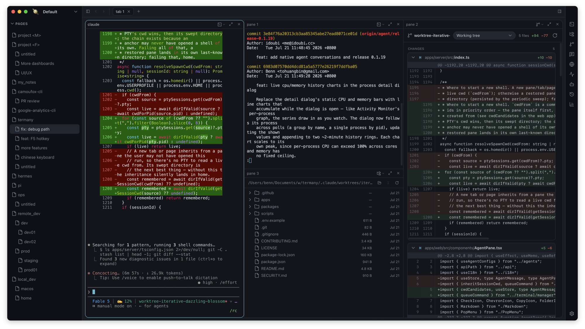

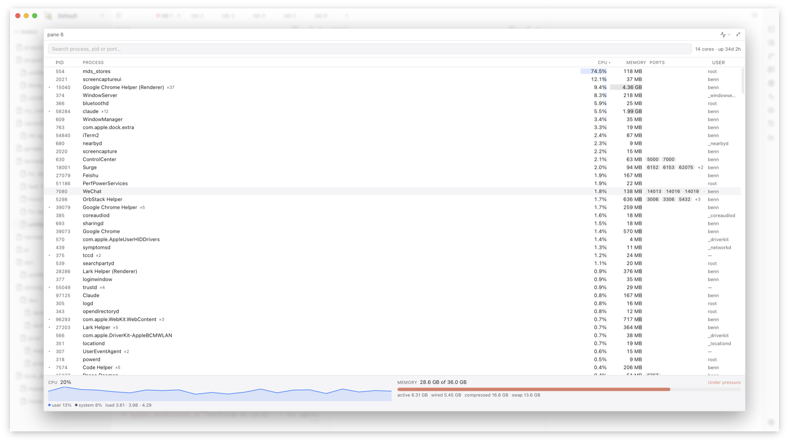

## Agent cost

Termany reads your agent transcripts and builds a usage view (⇧⌘U): estimated cost, input,
output and cache tokens, a daily chart, and breakdowns by model and by project.

> Usage and session history read Claude and Codex transcripts today. Other agents show as
> unsupported.


## Appearance and keys

Fourteen themes ship built in. A theme restyles the whole window, not only the terminal
palette: the sidebar, the tab strip, the gap and corner radius of each pane, and the shadow
under it all come from the theme — far enough that Windows 98 gets its bevels and navy title
bars back. Step through them with ⌥⌘. and ⌥⌘, or open the picker with ⌥⌘T.

<table>
  <tr>
    <td align="center" width="33%">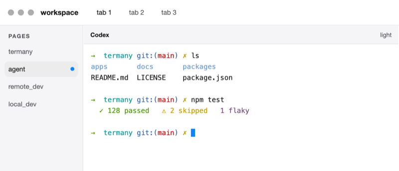<br><b>Codex</b><br><sub>Light · default</sub></td>
    <td align="center" width="33%">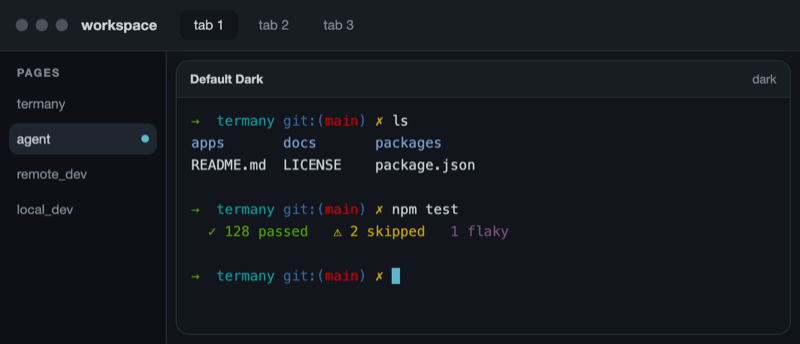<br><b>Default Dark</b><br><sub>Dark</sub></td>
    <td align="center" width="33%">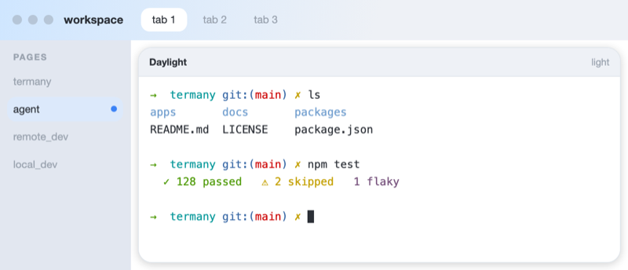<br><b>Daylight</b><br><sub>Light</sub></td>
  </tr>
  <tr>
    <td align="center">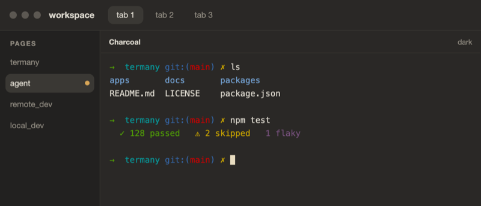<br><b>Charcoal</b><br><sub>Dark</sub></td>
    <td align="center">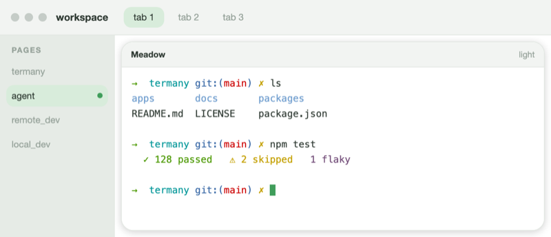<br><b>Meadow</b><br><sub>Light</sub></td>
    <td align="center">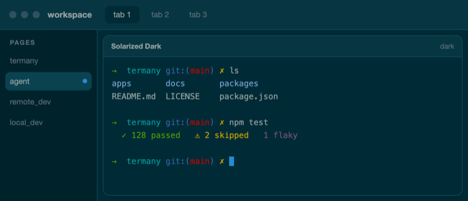<br><b>Solarized Dark</b><br><sub>Dark</sub></td>
  </tr>
  <tr>
    <td align="center">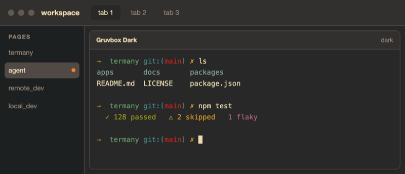<br><b>Gruvbox Dark</b><br><sub>Dark</sub></td>
    <td align="center">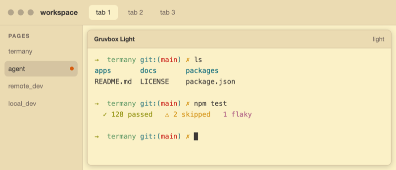<br><b>Gruvbox Light</b><br><sub>Light</sub></td>
    <td align="center">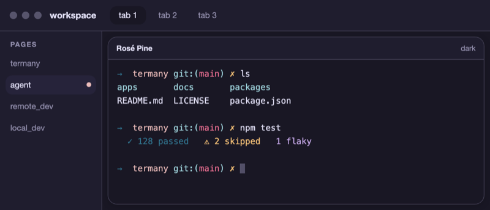<br><b>Rosé Pine</b><br><sub>Dark</sub></td>
  </tr>
  <tr>
    <td align="center">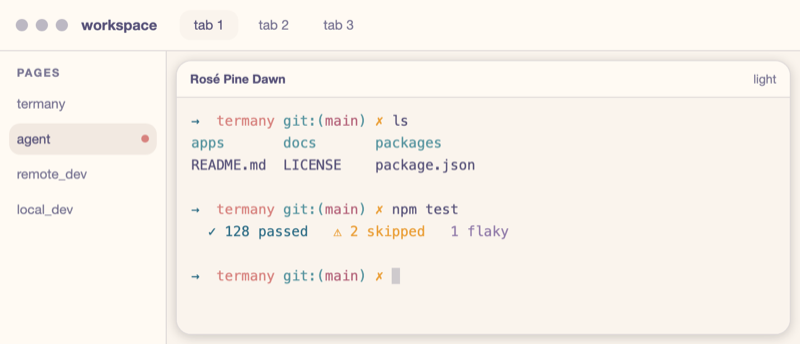<br><b>Rosé Pine Dawn</b><br><sub>Light</sub></td>
    <td align="center">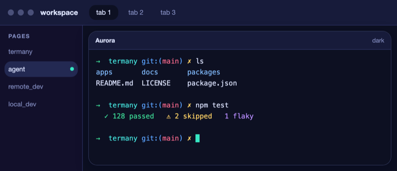<br><b>Aurora</b><br><sub>Dark</sub></td>
    <td align="center">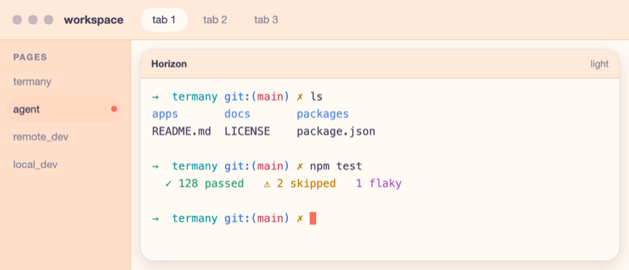<br><b>Horizon</b><br><sub>Light</sub></td>
  </tr>
  <tr>
    <td align="center">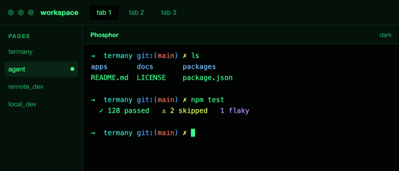<br><b>Phosphor</b><br><sub>Dark</sub></td>
    <td align="center">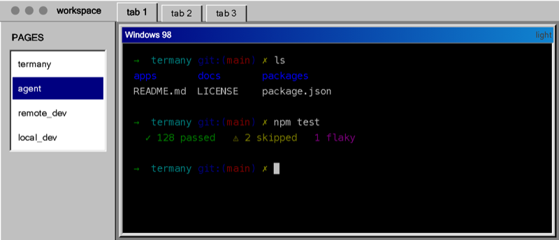<br><b>Windows 98</b><br><sub>Light</sub></td>
    <td></td>
  </tr>
</table>

Any [CodexThemes](https://codexthemes.ai) pack you install appears in Settings → Appearance
with its artwork, and applies in one click, next to the fourteen above.

All ~60 actions are rebindable in Settings → Keyboard. The right-hand rail hides the tools
you do not use. The interface ships in 21 languages.

## Install

Download a build from **[termany.sh](https://termany.sh)**, or run it from source.

## Run from source

```bash
npm install          # builds node-pty natively (needs Xcode CLT on macOS)
pnpm dev:web         # dev PTY server (:5175) + web (:15173) — open http://localhost:15173
pnpm dev:desktop     # the same, plus the badged Tauri Dev app
```

The desktop client wraps `apps/web` in [Tauri](https://tauri.app) and ships the Node PTY/API
server alongside it (a bundled Node runtime and `node-pty`), so it runs offline with no
separate install.

### Build installers

Installers are produced in CI (`.github/workflows/`), one job per OS:

- **macOS** (`build.yml`) — signed and notarized `.dmg`, attached to a draft GitHub
  Release. Requires the `APPLE_*` repository secrets.
- **Windows** (`build-windows.yml`) — NSIS `.exe`, uploaded as a build artifact.
  No secrets required (unsigned).

Both rely on `scripts/bundle-server.mjs`, which assembles the Node server for the
host platform before the Tauri build. To build the macOS DMG locally, see
`scripts/release-mac.sh`.

## Configuration

Model providers are **BYOK** (bring your own key). Add them at runtime in the app; they are
stored locally in `~/.termany/termany.db`. No keys live in this repository. Optional env vars:

| Variable            | Default        | Purpose                                  |
| ------------------- | -------------- | ---------------------------------------- |
| `TERMANY_PORT`      | `5174` release / `5175` dev | PTY/API server port            |
| `TERMANY_PASTE_DIR` | system temp    | Where pasted images are written          |
| `VITE_PTY_URL`      | `ws://localhost:5174` release / `:5175` dev | Web client → PTY WebSocket |
| `VITE_API_URL`      | follows `VITE_PTY_URL` | Web client → REST API                |

### Shortcuts

A starting set. All of them are rebindable in Settings → Keyboard.

| Key         | Action                          |
| ----------- | ------------------------------- |
| ⌘T          | New tab                         |
| ⌘N          | New page                        |
| ⇧⌘N         | New workspace                   |
| ⌥⌘N         | New window (desktop)            |
| ⌘W          | Close pane / tab                |
| ⌘D / ⇧⌘D    | Split right / down              |
| ⌘M          | Maximize / restore pane         |
| ⌘E / ⇧⌘E    | Cycle pane views / pane layout  |
| ⌘P          | Search pages, tabs & panes      |
| ⌘F          | Find in scrollback              |
| ⌥⌘G         | Git diff                        |
| ⇧⌘H         | Agent session history           |
| ⇧⌘U         | Agent token usage               |
| ⇧⌘M         | Activity monitor                |
| ⌥⌘ ← ↑ ↓ →  | Move focus between panes        |
| ⌃⌘ ← ↑ ↓ →  | Resize the focused pane         |
| ⌘B / ⇧⌘B    | Toggle sidebar / right rail     |
| ⌘K          | Clear the pane                  |

The desktop app can also show and hide its window from any app with a system-wide hotkey.
It ships off by default, because most usable chords are already taken (Spotlight, launchers,
IMEs, media keys), so pick your own in Settings → Keyboard → System-wide.

## How it's built

Local-first, cloud-ready. The same UI runs as a web app and as a desktop client today, and
as a cloud service later, by swapping one thing: the backend.

```
┌──────────────────────────────────────────────┐
│  apps/web   React + xterm.js                   │  ← shared UI
│   Workspace ▸ Page ▸ Tab ▸ Pane                │
├──────────────────────────────────────────────┤
│  packages/core   ITerminalBackend              │  ← the ONE seam
│    WebSocketBackend   (web / cloud)            │
│    LocalPtyBackend    (desktop, TODO)          │
├──────────────────────────────────────────────┤
│  apps/server   node-pty over WebSocket         │  ← local now; container-per-session later
└──────────────────────────────────────────────┘
```

Everything above `ITerminalBackend` is shared across web, desktop, and cloud. To target a
new environment you write one more backend. The UI does not change.

## Roadmap (next)

- **Session reconnect**: survive a page reload (server-side PTY persistence).
- **`LocalPtyBackend`**: an in-process pty backend for desktop. Today the desktop app talks
  to the bundled server over a local WebSocket.
- **Cloud**: move `apps/server` behind auth and a container-per-session sandbox.

## Contributing

See [CONTRIBUTING.md](CONTRIBUTING.md) for dev setup and PR guidelines, and
[SECURITY.md](SECURITY.md) to report a vulnerability.

### Contributors

Thanks to everyone who has contributed to Termany:

[](https://github.com/thinkany-ai/termany/graphs/contributors)

## License

[AGPL-3.0](LICENSE) © 2026 ThinkAny, LLC. Network use is distribution: if you run a modified
version as a service, you must offer users its source. For commercial licensing
outside the AGPL, contact support@thinkany.ai.

---

[termany.sh](https://termany.sh) is built with [ShipAny](https://shipany.ai).
