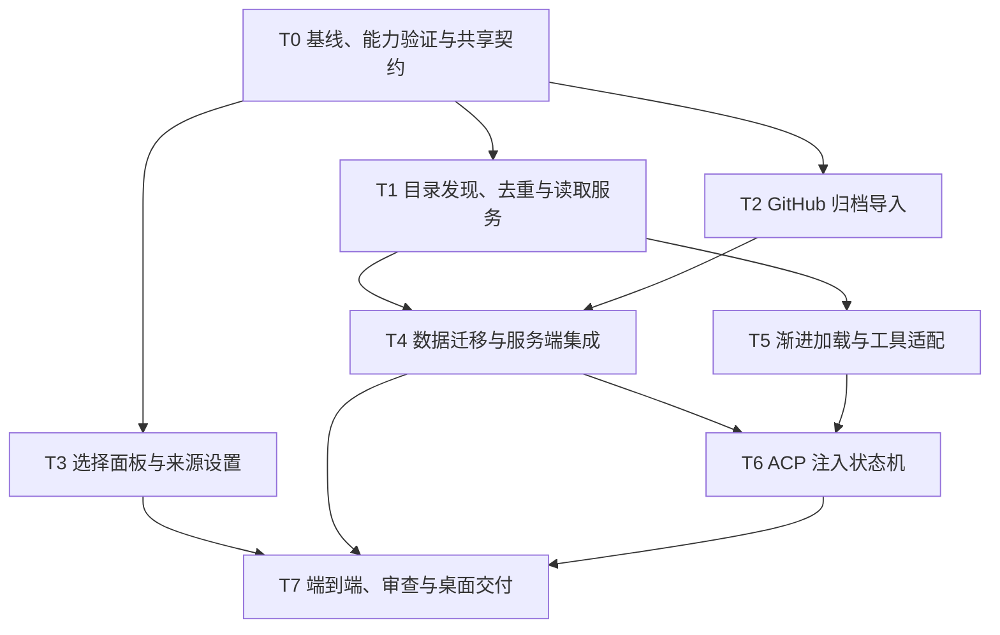

# Bot Skill 优化落地执行计划

> 2026-09-27 更新：本文中的 MCP、模型函数工具、引擎能力判定和
> `local`/`text` 模式设计已废弃。当前实现以
> `bot-skills-optimization-contract.md` 为准：所有绑定 Skill 在提示词中
> 提供绝对 `SKILL.md` 路径，由所选 Agent 的自身文件工具读取。

- 方案依据：用户测试 `0.2.6-bots.2` 后，本任务中关于目录发现、交互简化、渐进加载及 ACP 会话同步的连续讨论；用户已逐项确认。
- 编写日期：2026-09-27。
- 状态：本轮实施、独立审查、自动测试、真实 Codex 验证及 bots.3 DMG 构建验收已完成。详见 `bot-skills-optimization-validation.md`；Trae 本机未安装，保留实测限制。
- 协调职责：主线负责共享契约、迁移集成、运行能力验证和最终交付；模块实施与独立审查按下文分工。
- 工作区存在上一轮未提交的实现，实施前保留并记录基线，禁止清理或覆盖这些改动。

## 1. 已确认的目标与范围

| 编号 | 目标 | 完成后的行为 |
| --- | --- | --- |
| R1 | 全局目录发现 | 搜索默认覆盖 `~/.agents/skills`、`~/.claude/skills`、Codex 有效全局 Skill 目录及 Termany 下载库；支持自定义搜索目录 |
| R2 | 去重 | 重复路径和符号链接合并；完全相同的包合并展示；同名不同内容保留区分 |
| R3 | 取消版本管理 | Bot 绑定稳定 Skill ID；使用当前文件；删除选择、比较、删除历史版本等产品功能 |
| R4 | 合并行为字段 | 删除“补充指令”，把“简介”改为“描述”；保留并迁移已有内容 |
| R5 | 简化绑定 | 创建表单只保留已选 Skill 与添加入口；独立搜索多选面板；来源与下载维护移到 Skill 设置 |
| R6 | 修复 GitHub 导入 | 归档下载替代逐文件 REST API；分类错误、补诊断、复用下载结果 |
| R7 | 渐进加载 | 默认只注入绑定清单与读取方式，Agent 激活后读取完整 SKILL.md，其他资源按需读取 |
| R8 | ACP 减少重复注入 | 首次、恢复或配置变化时发送配置快照；其他普通轮次只发送短恢复入口 |
| R9 | 交付验证 | 测试、独立审查、生产构建、真实桌面 DMG 和包内服务验证 |

不扩展到全局 Skill 严格隔离、Skill 远程市场、云同步、自动 GitHub 更新、任意脚本执行工具、跨后台重启的完整 ACP 会话恢复、全新的多会话产品。本轮保留现有话题功能，不依赖新增对话入口。

新接口名、模块名和目录布局在本文中是拟议设计，须在 T0 对照代码定稿。扫描边界、缓存时效、分页大小、工具轮数等新增数值在 T0/T1 依据本机样本确定，不将未经验证的数值当成已确认要求。已有 8 个绑定、64 KiB 入口等限制先保留并调整语义；测试后如需更改，单独记录原因。

## 2. 事实基线与易混淆边界

- 当前 Skill 搜索来自 SQLite 的 `botSkills.v1` 注册表，不会自动发现外部目录。旧包位于 `~/.termany/skills/<id>/<revision>/`。
- 本机默认目录包含符号链接，扫描实现必须处理别名、重复覆盖和循环。
- Bot 是角色配置；话题是界面对话记录；ACP sessionId 是 CLI 内部会话。私聊话题和群聊成员各有运行标识，不能只按 Bot ID 记录注入状态。
- 当前每轮调用 `compileBotAcpPrompt`，配置与用户文本是两个 content block，但都属于同一次 ACP 用户消息，不是真正的 system/user 权限分离。
- 目前 ACP `mcpServers` 为空；内置模型聊天没有工具执行循环。不能仅注册一个 HTTP 路由就声称模型已有读取工具。
- 可恢复 CLI 空闲约 5 分钟后会保存检查点并回收进程，后续以 `session/load` 恢复。检查点在后台内存中；后台完全退出后不保证恢复原会话。
- 当前没有对全部 CLI 通用可靠的自动压缩检测。屏幕上的描述预算提示不能作为会话已压缩的证据。
- GitHub 历史失败记录只有 `GITHUB_ERROR / GitHub returned 403`，没有原始响应正文或限流头。隔离 Web 测试这次成功导入示例仓库，消耗 13 次 REST 请求；归档地址返回 200。限流是高概率原因，不是已证实的唯一历史原因。

## 3. 目标架构与数据职责

```text
默认目录 / 自定义目录 / Termany 下载目录
                    ↓
          SkillCatalog：发现、缓存、来源与去重
                    ↓
       稳定 skillId → 实际根目录 / 当前文件
                    ↓
         SkillReader：入口与资源读取
          ↙              ↓                ↘
 本地 CLI 文件工具   ACP 的 MCP 适配    内置模型函数工具
          ↘              ↓                ↙
           配置清单 + 渐进加载 + 运行结果
```

### 3.1 建议的数据模型

| 实体 | 核心职责 |
| --- | --- |
| SkillSearchRoot | 路径、是否默认来源、启用状态、递归配置及最近扫描状态 |
| SkillLocation | 注册 ID、规范路径、realpath、来源类型、可用性、文件状态、内容指纹 |
| SkillCatalogItem | 用于搜索的名称、描述、来源标签、去重分组和可选位置 |
| BotSkillBinding | 稳定 skillId；不再有 revision；内部迁移期允许识别旧绑定 |
| BotProfile | 名称、描述、有序绑定清单；不再产生新的 instructions 数据 |
| SkillImportJob | 下载、校验、选择入口、完成、失败、取消；错误分类和必要诊断 |
| SessionProfileState | 按运行实例保存 lastDeliveredFingerprint、needsRefresh 和发送中的快照标识 |

源目录、注册表和迁移标识存 SQLite 元数据；Skill 正文与资源留在磁盘。无需复制用户的全局 Skill。GitHub 下载保持 Termany 托管目录，每个条目只有一个当前副本。

Skill ID 不从内容哈希生成，否则修改文件会破坏绑定。相同内容的分组是展示层关系，不等于抹掉来源位置身份。已有绑定继续指向原位置；副本随后内容分叉时拆开显示，不让 Bot 悄悄切换到另一份。

### 3.2 来源发现与去重

1. 解析 `~` 和有效 Codex Home；对搜索根路径规范化、realpath 去重。不随意展开任意环境变量或执行路径文本。
2. 扫描元数据而非将全部正文加载进聊天；支持嵌套 Skill，排除缓存目录和托管库的备份、暂存区。
3. 以真实路径记录访问集合，阻止符号链接循环；允许常见的“Skill 入口软链接到实际目录”，记录明确的实际根目录。读取资源不得由内部链接越出该 Skill 允许范围。
4. 同一 realpath 直接合并。对于疑似相同的不同目录，先筛选，再后台比较相对路径与文件内容指纹；不能仅比较名字或 SKILL.md。大包比较失败或超限时保留独立结果，不误判为相同。
5. 冷扫描建立索引；打开选择面板先用缓存，再刷新。手动刷新仅扫描磁盘，不自动联网更新 GitHub 副本。
6. 目录不存在、权限不足、断链、入口无效分别报告；一处失败不阻断其他来源。
7. 删除搜索根只停止发现，不能删除外部文件。已绑定条目仍保留定位信息并标记来源状态；文件消失时报告不可用。

### 3.3 渐进加载契约

拟议内部接口：`getBotProfile(sessionScope)`、`readSkill(skillId)`、`listSkillFiles(skillId, directory?)`、`readSkillFile(skillId, relativePath, offset?, limit?)`。

- `readSkill` 返回完整入口文本、资源根目录、内部内容指纹，不静默裁断正文。过大则明确报错。
- 资源列表及资源读取支持分页/分段，返回是否读完及下一段位置，避免无提示截断。
- 不执行脚本，不把下载或读取等同于安装依赖。脚本运行仍依赖 CLI 本身的工具与权限。
- 绑定角色 Skill 在首次任务时应主动激活，不等待用户再点名；当前上下文已具备且内容未变化时可以复用。
- 只注入当前 Bot 的绑定元信息，不重复注入整个全局目录。元信息预算超限明确提示，不以静默缩短代替配置处理。
- 文件指纹负责变更与缓存，不代表模型已记住内容；压缩后可以重新读。
- 移除 Skill 时，后续配置明确废止旧绑定；不能物理删除已经存在于 CLI 历史中的内容，也不能承诺模型绝对忘记。

### 3.4 引擎适配与支持边界

| 引擎能力 | 接入方式 | 必须验收 |
| --- | --- | --- |
| 本地 CLI 具备文件读取能力 | 绝对入口路径 + 会话配置清单文件，复用原生工具 | 路径不在 cwd 也能按当前权限读取；工具记录或 fixture 确认真实读取 |
| ACP Agent 支持所需 MCP 传输 | 将同一 SkillReader 包装为会话范围的 MCP 服务 | 初始化能力和真实调用验证，不能只以“ACP”标签判定 |
| Termany 内置直连模型支持工具调用 | OpenAI/Anthropic 分别注册函数工具和结果循环 | 流式参数组装、工具结果角色、取消、错误、循环预算以及多轮历史保留 |
| 不具备以上任何读取能力 | 清楚显示不支持渐进加载 | 不伪装成功，不暗中退回逐轮注入全文 |

优先验证用户正在用的本地 Codex/Trae CLI。MCP 适配不能假定所有引擎支持同一种传输，须在 T0 形成能力矩阵。未知引擎展示“未验证”，不能一律当作文件可读。

工具侧按后端会话绑定关系授权，模型不能通过猜测别的 Bot ID 扩大可读范围；这是专用工具的边界，不是对 CLI 全局工具进行严格隔离。MCP 若采用 HTTP，限定本机并使用会话凭据；若采用 stdio，核实打包后的启动路径。恢复清单不含令牌、密钥。

内置直连模型通常需要每个模型请求继续提供 system 配置和工具定义；这不是向 ACP 历史反复追加消息。不能把 ACP 的 lastDeliveredFingerprint 逻辑照搬到无状态模型 HTTP 请求。

### 3.5 ACP 注入状态机

运行状态按私聊话题 / 群聊成员等现有 paneId 和对应运行实例管理，不按 Bot ID 共用，也不把持久化聊天记录误当成 CLI 上下文。

| 条件 | 下一轮普通请求 |
| --- | --- |
| 新运行实例、恢复实例、没有成功同步记录 | 配置快照 + 用户原文 |
| 最新配置指纹变化 | 最新配置快照，明确替换旧配置 + 用户原文 |
| 同一实例且配置未变 | 短配置标识与真实恢复入口 + 用户原文 |
| Termany 控制的重建或明确已知的压缩/重置 | 标记 needsRefresh，下一轮发快照 |
| 未报告的自动压缩 | 不猜测；短入口支持重新获取配置与 Skill |
| 运行命令 | 保持命令原样；识别且可能影响上下文的命令之后保守标记待同步 |

配置快照仅含名称、描述、绑定元信息、读取方式和优先级规则。描述的明确要求优先于绑定 Skill，绑定清单顺序用于冲突时的稳定优先关系；用户本次输入定义当次任务；不得宣称覆盖 CLI 的系统规则或权限。

指纹涵盖模型可见配置、绑定顺序、读取位置、入口内容指纹、能力/提示词模板版本。头像不纳入。资源文件按读取时检查，不必为每轮指纹重新哈希整个目录。

在发送边界取得不可变快照。中途配置更新留给下一轮；失败、取消、连接状态不明时保守重发，不能在发请求前就永久标记成功。同一实例的发送和指纹提交必须与现有并发控制一致。

恢复清单按运行作用域原子生成，当前配置可重新读取；避免不同 Bot/话题竞争覆盖。临时保留、清理时机和失效行为在契约中明确。文本块分开加边界，用户原文不改写；这仍属于 ACP 用户消息，不是原生 system prompt。

不使用 token 数下降、回复中出现“压缩”或截图中的预算警告推断压缩。明确完成事件需要逐引擎验证；仅发送了 `/compact` 时可保守刷新，但日志不能写成“已确认压缩成功”。

## 4. 旧数据迁移与回退

迁移是本轮高风险点，必须在隔离数据库副本上先完成：

1. 用一致性备份方式保存 SQLite；有 WAL 时不能仅复制主 db 文件。记录旧元数据、引用清单与迁移标识。
2. 新注册表使用独立 schema 标识；启动识别旧配置并幂等迁移。
3. `description` 为空时迁入旧 instructions；两者都有时完整保留，以可读的“角色描述 / 优先约束”组合；相同文本不重复拼接。不得截断超限旧内容，需标记待处理并保留原数据。
4. 新运行链路只注入合并后的描述，停止单独注入 instructions。描述现在承担明确约束，属于已确认的行为变化，迁移说明中列出。
5. 按旧 `(skillId, revision)` 的实际绑定内容迁移，不能直接指向 GitHub 最新或本地源目录当前内容。
6. 同一旧 Skill 的不同已绑定内容迁为独立当前条目；相同内容可以合并展示。旧版本目录不再出现在日常 UI。
7. 旧 `contextFiles` 不再自动全文注入；作为高级读取偏好/兼容元数据保留，必要时提醒 Agent 按需读取。需要文档说明它不再保证每轮附带全文。
8. 下载目录采用暂存、校验、替换流程；失败保持旧副本可用。部署时暂停相关写入或使用读取租约，避免更换目录时入口和参考资料来自不同副本。
9. 首个兼容版本保留旧数据和文件备份但排除搜索，不立即物理清理。迁移失败不提交完成标识，重启可重试。
10. 回退使用匹配的旧应用和迁移前备份；明确会失去升级后的新增配置。不能承诺旧二进制直接读取新 schema；停止后台写入后才能回退。

## 5. GitHub 导入改造

### 5.1 下载与安装

- 保留公共 GitHub 链接入口，使用归档下载替代 `commit → tree → N blobs`。
- 默认使用仓库默认分支；分支/子目录放高级选项。具体链接形式在 T0 以官方格式和实测定稿。
- 同一个任务下载一次；发现多个 SKILL.md 时保留暂存结果，让用户选择后完成导入，不重新请求整个仓库。
- 同源、同入口重复导入复用稳定 ID；来源键应包含实际选择的入口，避免多 Skill 仓库相互覆盖。
- 重新导入改变当前副本，会影响绑定此条目的 Bot；展示明确结果和受影响范围。不新增历史版本选择器。
- 校验压缩后与解压后大小、文件数量、绝对路径、`..`、符号链接/硬链接和特殊文件；拒绝越界解压。无需执行仓库脚本。
- 保留取消和超时；串行提交目录与注册表，失败/中断不留下半安装条目。

### 5.2 错误分类与日志

拟议错误类别：限流、权限拒绝、仓库/引用不存在、网络/代理错误、超时、无 Skill 入口、归档不合法、包超限。

记录任务 ID、阶段、HTTP 状态、GitHub request ID、受限长度的错误正文、Retry-After 和限流头；不得输出认证令牌。非 JSON 错误响应也必须可诊断。

限流时显示可重试时间并尊重退避；普通 403 不能一律翻译成限流。公共仓库不以配置 Token 作为默认前置条件，归档下载也不保证永远不受访问限制。

## 6. UI / UX 落地

### 6.1 创建和编辑 Bot

保留：头像、名称、驱动、描述、已选 Skill 摘要与添加入口。描述提供角色/回答方式示例，列表显示摘要，完整文本只在编辑处展示。

删除：补充指令、版本选择/比较、历史版本删除、创建流程中的 token 预算和全文预览。保存时自动校验，失败定位到问题 Skill，不丢草稿。

绑定默认按选择顺序；移除是直接操作，调整顺序放更多菜单，保留键盘可用的调整方式。描述清空和绑定清空必须同步到运行会话，不能遗留旧角色。

### 6.2 Skill 选择面板

独立面板内提供统一搜索、多选、名称、简短描述、来源标签和选择数量；底部一次添加所选项。支持键盘、焦点返回、取消不提交草稿。

详情展示正文/来源/资源信息，不默认展开文件管理。GitHub 导入完成自动选中，确认后绑定，不要求再次搜索。

覆盖首次扫描、加载、无结果、目录异常、缺失 Skill、同名冲突、重复来源、导入中/失败/成功、达到绑定上限等状态。错误来源不淹没可用结果。

### 6.3 设置中的 Skill 来源管理

新增搜索目录页面：默认目录开关、自定义目录添加/移除、扫描状态和刷新。选择目录是添加搜索根，不是复制整个目录。下载项管理与外部目录区分；移除 Bot 绑定永远不删除文件。

对不支持渐进读取的引擎给出明确提示；本地 CLI 不常驻展示“仅文本模式”等开发细节。高级工具诊断与提示词预览留在诊断入口。

## 7. 任务依赖与实施顺序



T1/T2/T3 在共享契约冻结后可并行；前端可用契约 fixture 开发，但不能用模拟页面替代最终真实接口验收。T4 集成后，T5 的引擎工具循环可继续独立实现。主线负责所有共享文件接线，避免并行互相覆盖。

| 任务 | 交付物与修改范围 | 前置 | 禁止并行修改的共享区域 | 完成判据 |
| --- | --- | --- | --- | --- |
| T0 主线 | `packages/core/src/bot.ts`、导出、契约文档、能力矩阵、迁移与配置指纹规范 | 无 | 不覆盖已有改动 | 类型编译通过；各任务输入输出与所有权冻结 |
| T1 库后端 | 新 `skillCatalog.ts`、`skillReader.ts` 及测试；原 `skills.ts` 仅按约定拆分 | T0 | 不改 core、index.ts、UI、运行时 | 自动发现、去重、变更读取、路径边界测试通过 |
| T2 下载后端 | 新 `skillGithubImport.ts` 及测试 | T0 | 不改注册表实现、共享类型、入口接线 | 归档导入、多入口复用、错误分类与取消通过 |
| T3 界面 | `BotBehaviorForm.*`、新增选择器/来源设置、`botBehaviorForm.ts`、i18n | T0 | 不改 store.ts、AgentWorkspace.tsx、SettingsDialog.tsx、server | 真实设计状态和交互测试通过；需主线集成的位置提供补丁说明 |
| T4 主线迁移集成 | 新迁移模块、db.ts、skills.ts、skillsHttp.ts、index.ts、store.ts、botProfile.ts、AgentWorkspace/设置入口 | T1/T2；按需接入 T3 | 集成期集中写入 | 旧数据无丢失、幂等、源文件不变、前后端真实接口连通 |
| T5 读取适配 | 新会话清单/MCP/工具执行模块、agentChat.ts 及测试 | T0/T1 | 不改 acpRuntime.ts、core、index.ts；接线交主线 | 本地文件通路、支持的 MCP 和内置模型循环可验证，未知能力不误报 |
| T6 主线运行时 | botContext.ts、botIdentity.ts、acpRuntime.ts、fastClawRuntime.ts、群聊相关接线及测试 | T4/T5 | 暂停其他任务写运行时 | 按实例同步、无重复正文、失败重试、恢复入口和命令透明通过 |
| T7 集成验证 | 文档、测试 fixture、打包脚本必要修正、DMG | T3/T4/T6 | 功能修复交模块所有者 | 验收矩阵全部有结果，独立审查无阻塞，安装包验证通过 |

现有 `SettingsDialog` 等接线文件由 T0 再核实准确路径；新模块名只是建议，避免仅为符合表格而机械拆文件。若契约必须修改，由主线统一变更并通知依赖任务。

## 8. 可直接派发的模块任务提示词

以下路径均相对仓库 `/Users/bytedance/Projects/termany`。所有任务先完整阅读本计划及 T0 冻结的契约。以下为执行时使用的任务模板，实际所有权以冻结契约为准。

### T1：目录发现与读取服务

> 你负责 Bot Skill 目录发现、去重和统一读取服务。必读 `/Users/bytedance/Projects/termany/docs/bot-skills-optimization-execution-plan.md` 第 2—4 节、`packages/core/src/bot.ts`、`apps/server/src/skills.ts`。只修改主线分配的 catalog/reader 模块及其测试，不修改共享类型、UI 和入口接线。实现默认/自定义根目录、软链接与循环处理、完整包去重、稳定位置身份、缓存刷新和受约束资源读取。验证同名不同资源不合并、相同软链接不重复、文件更新保留绑定、目录异常不阻断其他来源。契约缺口报主线，不自行扩展。自测后调用独立 Code Review agent 审查，逐项修复并复审至无阻塞项；回报改动、测试、剩余限制和审查处理情况。

### T2：GitHub 归档导入

> 你负责替换逐文件 GitHub REST 下载。必读本计划第 5 节、`apps/server/src/skills.ts` 和冻结的导入 job 契约。仅修改新的归档导入模块及测试，不修改注册表提交、UI、core 或 index.ts。交付归档下载/校验、取消超时、多入口复用、分类错误和脱敏日志；用受控响应覆盖限流/普通 403/HTML 错误等，不靠耗尽真实限额制造故障。正常示例仓库不再调用每文件 blob API。安装提交由主线接入，提供清楚接口。自测后调用独立 Code Review agent，修复并复审至无阻塞项，附测试与审查记录。

### T3：绑定界面与来源设置

> 你负责简化 Bot Skill 交互。必读本计划第 6 节、`BotBehaviorForm.tsx/.css` 和共享 API 契约。只修改表单、独立选择器/来源组件、表单帮助函数及翻译；store、Workspace、全局设置容器接线交主线。删除补充指令与版本 UI；名称、描述、来源标签构成结果，多选一次确认；导入成功自动选中，保留原草稿。覆盖浅深主题、窄窗口、键盘、加载/空/错/冲突状态。不得把所有搜索结果注入 prompt。真实接口接入前可使用 fixture，但必须标明模拟范围。自测后调用独立 Code Review agent，修复复审；提交验证截图/步骤、测试和集成说明。

### T5：读取工具与模型适配

> 你负责统一 SkillReader 的运行接入。必读本计划第 3.3—3.5 节、`agentChat.ts`、ACP 初始化能力和 T0 能力矩阵。只修改会话清单、MCP/函数工具模块、agentChat.ts 与相关测试；acpRuntime/index/core 接线交主线。实现本地绝对路径恢复清单、支持的 MCP 工具适配和内置 OpenAI/Anthropic 工具调用循环。工具权限取自后台会话，不信任模型传入 Bot ID；保留历史中的工具结果而非每轮重复读取；处理流式参数、取消、无效调用、读取失败和预算。无能力引擎明确报告，不用全文注入掩盖。自测后调用独立 Code Review agent，修复复审，回报实际支持矩阵和验证证据。

### T4/T6：主线集成审查提示词

> 独立审查本计划的数据迁移和 ACP 同步实现。重点检查旧描述/补充指令无损合并、不同旧 revision 不被最新内容覆盖、绑定清空与群聊传播、回退边界、不同话题/成员不串状态、文件变化触发刷新、取消或失败不提前提交指纹、恢复清单真实可读、自动压缩能力不被夸大、命令原文保留。不得修改并行任务文件；给出可复现问题、严重度和代码位置，由主线修复后再次审查。

并发限制下为审查保留一个可用槽位；开发任务收尾再派独立审查，不让子任务无限嵌套。若没有名为 code-review 的专用工具，可用独立审查 agent 执行上述职责，不得用开发者自评冒充独立审查。

## 9. 验收矩阵

| 领域 | 关键用例 | 通过标准 |
| --- | --- | --- |
| 来源 | 默认目录、自定义嵌套、缺失/无权限、软链接环 | 可用项可搜索，错误就地反馈，不卡住整个库 |
| 去重 | 同路径别名、完全相同副本、同名不同 references、副本随后变化 | 不重复展示、不误合并、已有绑定不悄悄换源 |
| 动态读取 | 修改/删除入口，改变资源，包替换时并发读取 | 新内容按下一轮生效；失效可恢复；不返回混合半成品 |
| 迁移 | 空字段、仅旧 instructions、两者同时有、超限、不同 revision、重复启动、中途失败 | 无丢失、无静默截断、幂等、原文件保留，可从备份回退 |
| 导入 | 示例公开仓库、多入口、403 限流/非限流、429、404、非 JSON、断网、取消、超大包、路径穿越 | 正常完成或分类失败；无逐文件 REST；选择入口不重新下载 |
| UI | 搜索、多选、取消、移除、顺序、导入后绑定、目录管理 | 创建主流程没有版本/补充指令/文件管理负担；错误不丢草稿 |
| 渐进加载 | 首次角色激活、参考文件按需、清单中出现不同真实目录 | prompt 不含全文；实际读取后可在结果中识别 fixture 独有内容 |
| ACP 同步 | 首次、第二轮、描述变更、绑定清空、Skill 修改、取消、失败、恢复、新话题、群聊 | 首次/变化发快照，普通轮次只发短入口，正文不重复追加，不串 Bot |
| 压缩与命令 | `/compact` 通过、明确完成事件、静默压缩 fixture、其他 slash command | 命令不破坏；可重新读取；不把猜测日志写成已确认事件 |
| 工具适配 | 原生文件、MCP、OpenAI、Anthropic、无工具模型/Agent | 支持项真能调用；不支持项明确提示；权限和取消正确 |
| 持久化 | 保存后刷新、重启服务、话题历史还在但 CLI 会话不在 | UI 配置保留；新运行实例重新同步；不误称跨重启恢复 |
| 桌面 | 包内依赖、服务版本、Skill 接口、目录读取、真实 CLI | DMG 可挂载、签名可校验、服务可启动、版本对应；真实环境结果有记录 |

渐进加载不能只检查“回答像某个人”。测试 Skill 放唯一标记，工具记录/fixture 确认真实读过文件。模拟 Agent 验证传输与状态机，真实 Codex/Trae 验证各自读取能力；工具已配置但模型没调用必须与成功加载区分。

性能验证用真实本地目录样本记录冷扫描、热搜索、增量刷新耗时、文件数量和内存。首屏先显示缓存，扫描不能在主 UI 线程阻塞；不在每个按键或每轮消息时重扫全部资源。不承诺未测的固定毫秒指标。

## 10. 里程碑与发布门槛

| 里程碑 | 交付内容 | 进入下一阶段的条件 |
| --- | --- | --- |
| M0 | 基线、冻结契约、引擎能力矩阵、迁移设计 | 所有接口和共享文件所有权明确 |
| M1 | 目录库、去重、归档下载、统一读取 | 后端功能测试与独立审查通过 |
| M2 | 新选择器、描述合并、无版本数据迁移 | 旧数据副本迁移及真实页面操作通过 |
| M3 | 工具接入、渐进加载、ACP 状态机 | 私聊/话题/群聊、恢复与失败用例通过 |
| M4 | 整体验收与 DMG | 无阻塞审查问题，所有目标能力有真实证据或明确不支持结论 |

每个模块先做针对性测试，再执行全量 `npm -w @termany/server test`、`npm -w @termany/web test`、`npm run build:web`、`npm run bundle:server`。涉及 Rust 生命周期或打包逻辑时补相应 Rust 测试。新增测试验证用户可观察行为和错误边界，不用大量源码字符串断言代替行为验证。

包内若新增 MCP 入口或归档依赖，必须随内置 Node 一并打包，并在未依赖开发目录的条件下启动。构建产物、服务 `/api/version` 和桌面版本统一；最终版本号实施完成时确定，不复用旧测试包版本掩盖差异。

对挂载后的 DMG 用隔离目录验证服务、默认来源配置、Skill 导入/读取接口和配置恢复；用户真实目录只读扫描，不自动导入、删除或改写全局 Skill。不得为了升级测试强杀用户运行中的任务。

最终交付：代码、迁移与回退说明、能力矩阵、测试/审查记录、UI 验证记录、DMG 下载路径与校验值。说明是否本地签名及是否公证。新功能验证失败不能通过仅美化错误消息宣称修复。

## 11. 开发启动检查清单

- [x] 保存工作区基线，确认上一轮代码与本计划范围。
- [x] T0 完成契约、真实引擎能力验证和文件所有权分配。
- [x] 用数据库副本建立旧数据迁移 fixture。
- [x] T1/T2/T3 分模块实施，独立审查后集成。
- [x] T4 完成迁移和来源设置接线。
- [x] T5/T6 完成工具适配、渐进加载与按会话同步。
- [x] 完成第 9 节矩阵，记录无法验证的能力及原因，不隐瞒。
- [x] 完成生产构建、包内验证及新版 DMG 交付。
